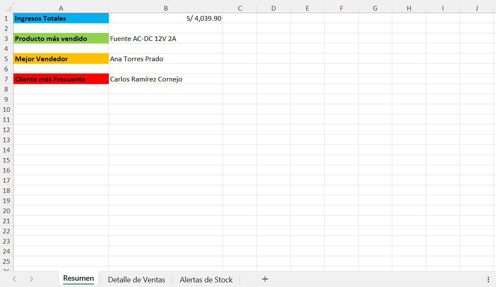
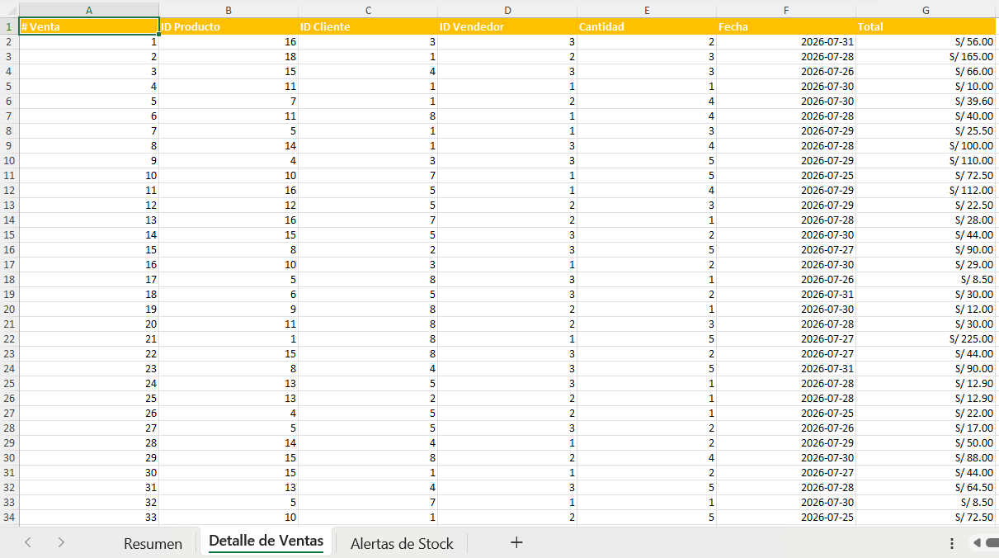
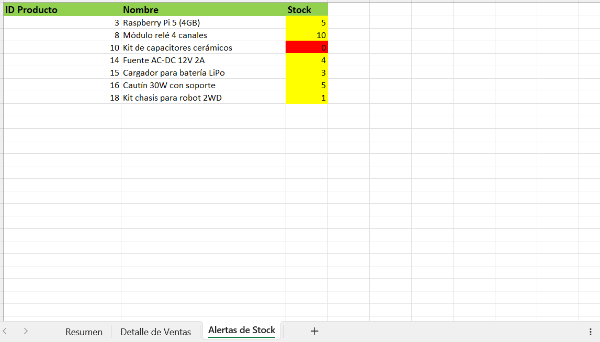

# Electro Store - Automatización de Generación/Envío de Reportes de Ventas

Automatizo la generación y envío de reportes de ventas para una tienda ficticia de electrónica y robótica llamada "Electro Store" usando Python y Excel. Este es un proyecto de portafolio para mis prácticas preprofesionales en Análisis de Datos e Inteligencia Artificial.

## Objetivo
Implementar y mostrar un pipeline de automatización completo, el cual vaya desde la generación de datos hasta la entrega del reporte, utilizando conceptos de programación orientada a objetos, manejo de excepciones (try-except), manipulación de archivos Excel y envío automático de correos electrónicos.

## ¿Qué hace el proyecto?
- **Genera datos de ventas:** Genera un catálogo de 18 productos de electrónica, tales como placas de desarrollo, sensores y demás componentes.
- **Calcula métricas de negocio**: Calcula métricas como los ingresos totales, el producto más vendido, el mejor vendedor, el cliente más frecuente y alertas de los productos con poco o sin stock.
- **Genera un reporte en Excel** Crea un archivo Excel con 3 hojas formateadas: Resumen, Detalle de Ventas, Alertas de Stock, todo con la librería openpyxl.
- **Envía el reporte automáticamente por correo** Envía un correo con asunto, cuerpo y el reporte en Excel como archivo adjunto utilizando la librería smtplib y clases como MIMEMultipart.

## Tecnologías usadas
- **Python 3.13**
- **openpyxl** - Para generar y personalizar el archivo Excel
- **smtplib** - Para enviar emails con el protocolo SMTP
- **random / datetime** - Para simular datos realistas y aleatorios
- **getpass** - Para esconder las credenciales
- **collections** (defaultdict) - Para el conteo eficiente de métricas de negocio

## Estructura del proyecto
Electro-Store-Automatizacion-Reportes/ 

├── main.py # Orquesta todo el pipeline

├── modelos.py # Clases del dominio: Producto, Cliente, Vendedor, Venta, Inventario

├── generador_datos.py # Simula ventas ficticias

├── reporte_excel.py # Genera el reporte en Excel

├── enviar_correo.py # Envía el reporte por correo

├── capturas_pantalla/

│   ├── Hoja_Resumen.png

│   ├── Hoja_Detalle_Ventas.png

│   └── Hoja_Alertas_Stock.png

└── README.md

## Instalación

### 1. Crear el entorno con Anaconda

```bash
conda create -n electrostore python=3.13
conda activate electrostore
```

### 2. Clonar el repositorio

```bash
git clone https://github.com/TonaDav/electro-store-automatizacion-reportes.git
cd electro-store-automatizacion-reportes
```

### 3. Instalar dependencias

```bash
pip install openpyxl
```

### 4. Configurar el intérprete en PyCharm

En `File → Settings → Project → Python Interpreter`, selecciona el entorno conda `electrostore` ya creado.

## Uso

Ejecuta el pipeline completo con:

```bash
python main.py
```

Esto va a:
1. Generar 50 ventas ficticias (o menos) (algunas pueden fallar por validación de stock — comportamiento esperado)
2. Crear el archivo `reporte_electrostore.xlsx`
3. Solicitar la credenciales de correo (con una contraseña de aplicación de Gmail)
4. Enviar el reporte al destinatario configurado

## Capturas del reporte generado
### Hoja Resumen


### Hoja Detalle de Ventas


### Hoja Alertas de Stock


## Hecho por

**Luis Tomás Dávila Naveda**
Estudiante de Ingeniería de Sistemas de Información - USIL

- Email: tonadavnav05@gmail.com
- LinkedIn: [linkedin.com/in/tomasdavilanaveda](https://www.linkedin.com/in/tomasdavilanaveda)

## Licencia

Este proyecto está bajo la licencia MIT.